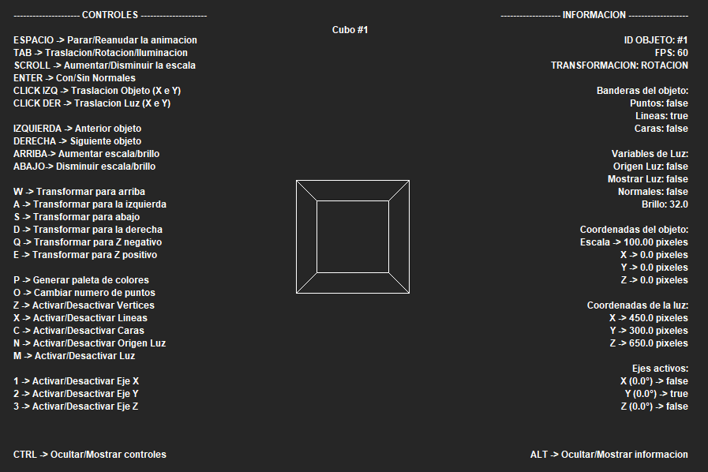
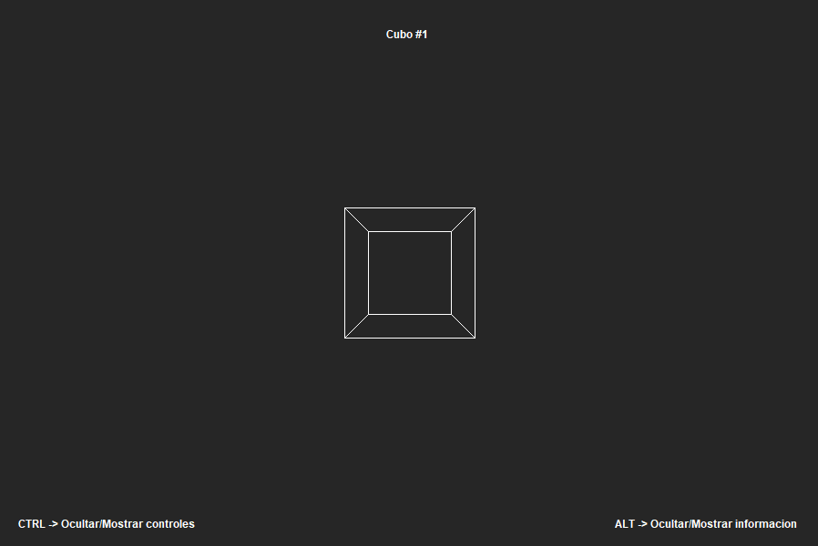
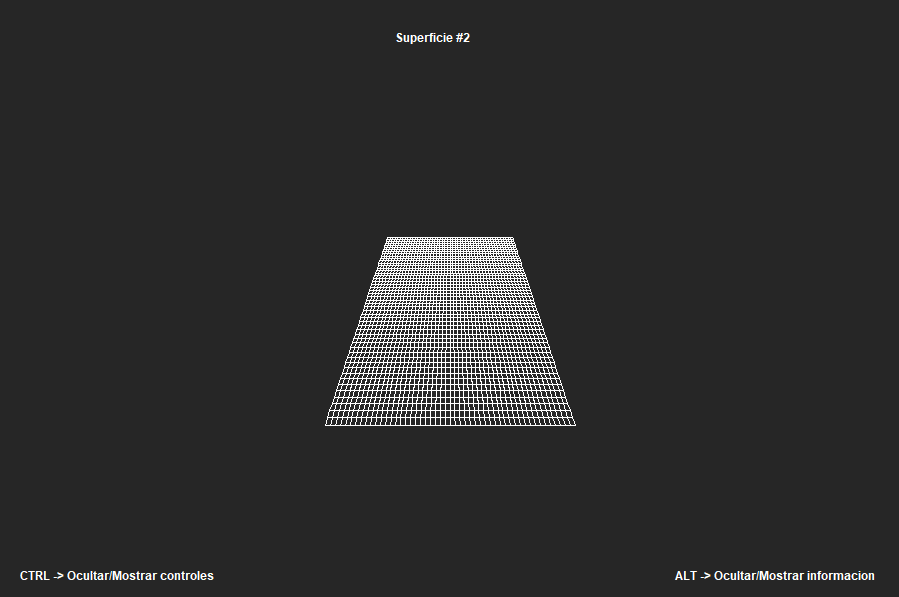
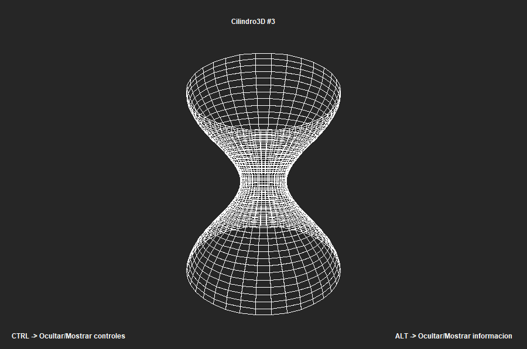
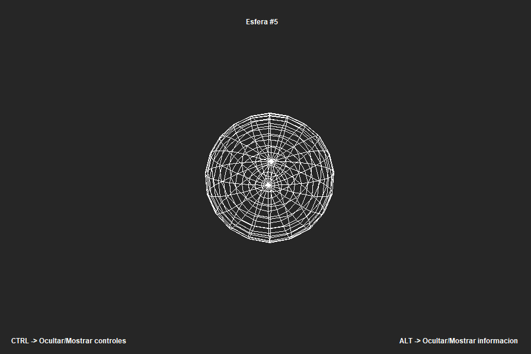
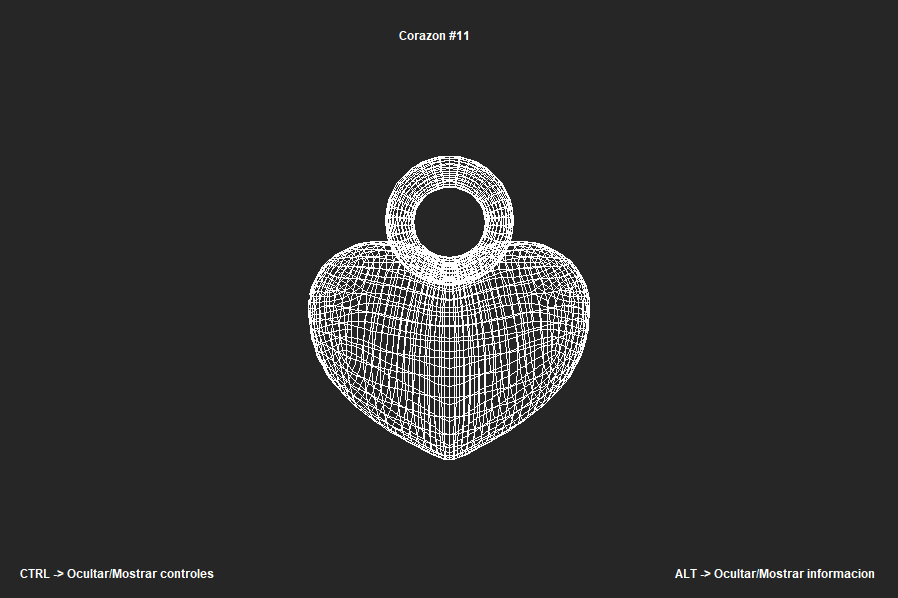
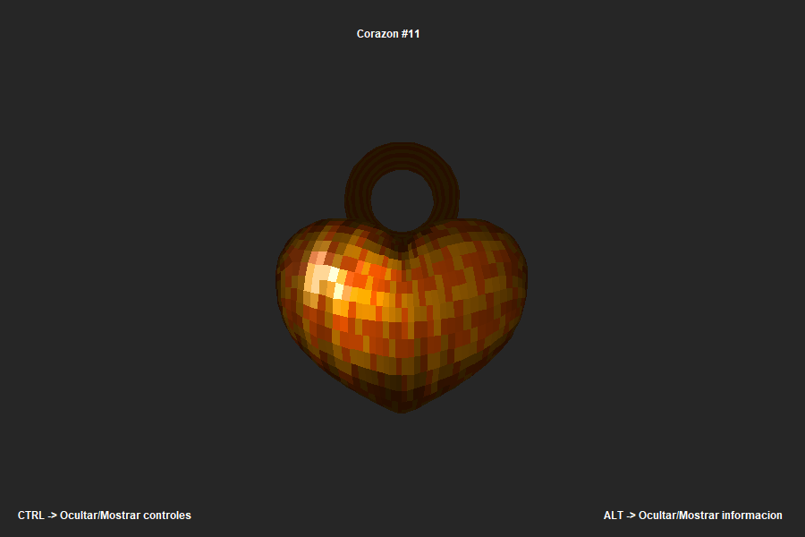
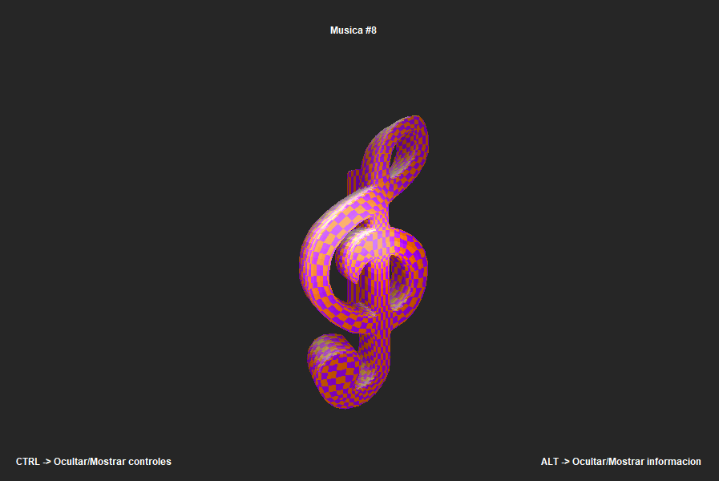
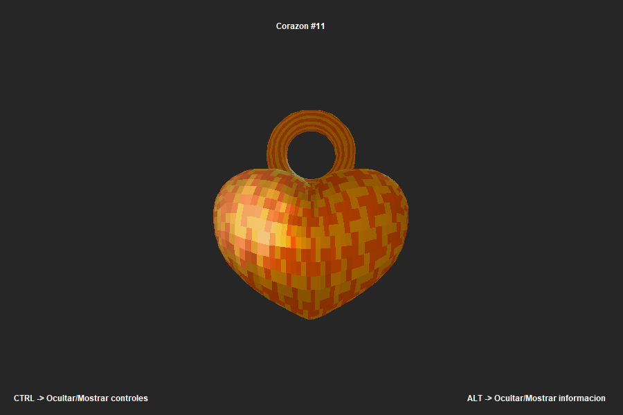

# **3D Viewer**
3D-Visualizer is my third-term project for the 2D and 3D Computer Graphics course. It covers fundamental concepts for 3D graphics representation, such as parallel projection, perspective projection, translation, scaling, rotation, curves, surfaces, and more. Additionally, for improved visualization, the project incorporates double buffering (to prevent flickering during rendering), hidden surface determination (using a Z-buffer to render only visible surfaces), the Phong illumination model (including ambient, diffuse, and specular lighting) using flat shading, and concurrency (utilizing multiple threads for different tasks in parallel).

## Main Screen.

## 3D Models (Only Lines).

## Hidden faces (3 examples)

## Phong Lighting Model Without Normals (4 examples)

## Phong Lighting Model With Normals (3 examples)

